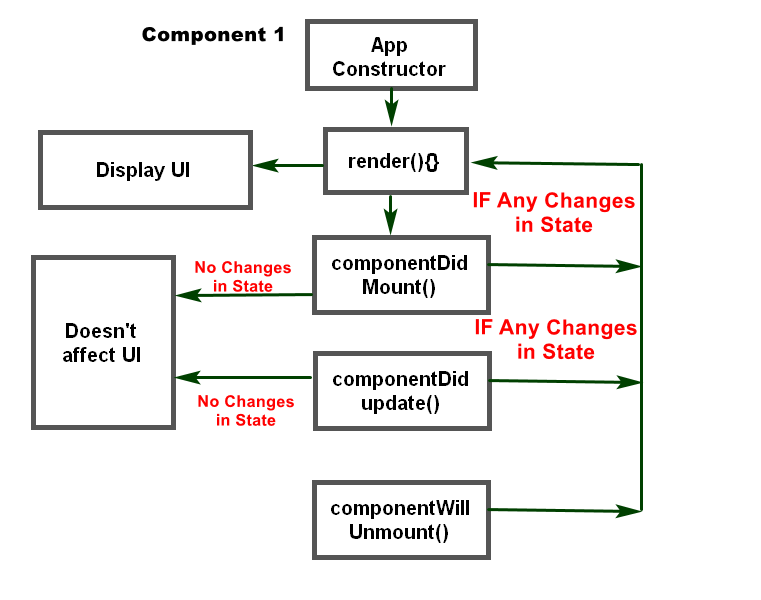
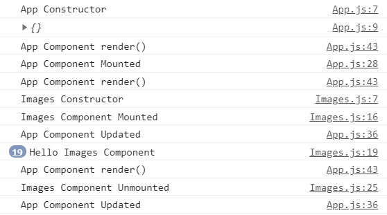

Creating React project in a plain form

React COMPONENT LIFECYCLE 
Diagram:

Console output Diagram:

NOTE:
- Every Change in State, componentDidUpdate() will run and execute render() for re-rendering
-  
